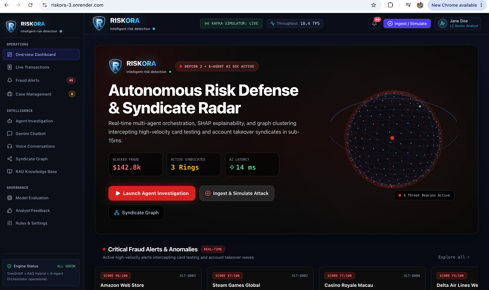
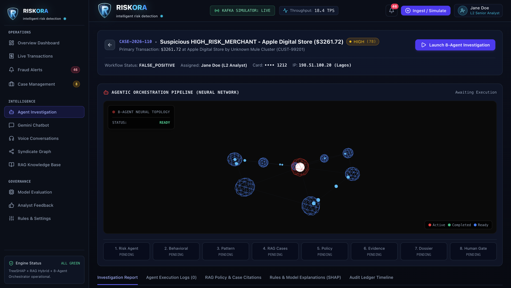
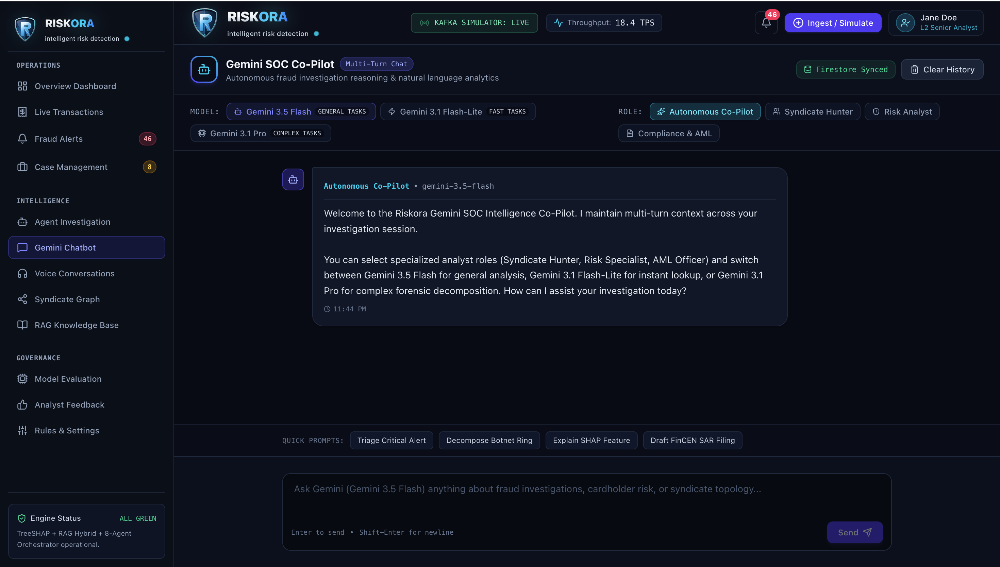
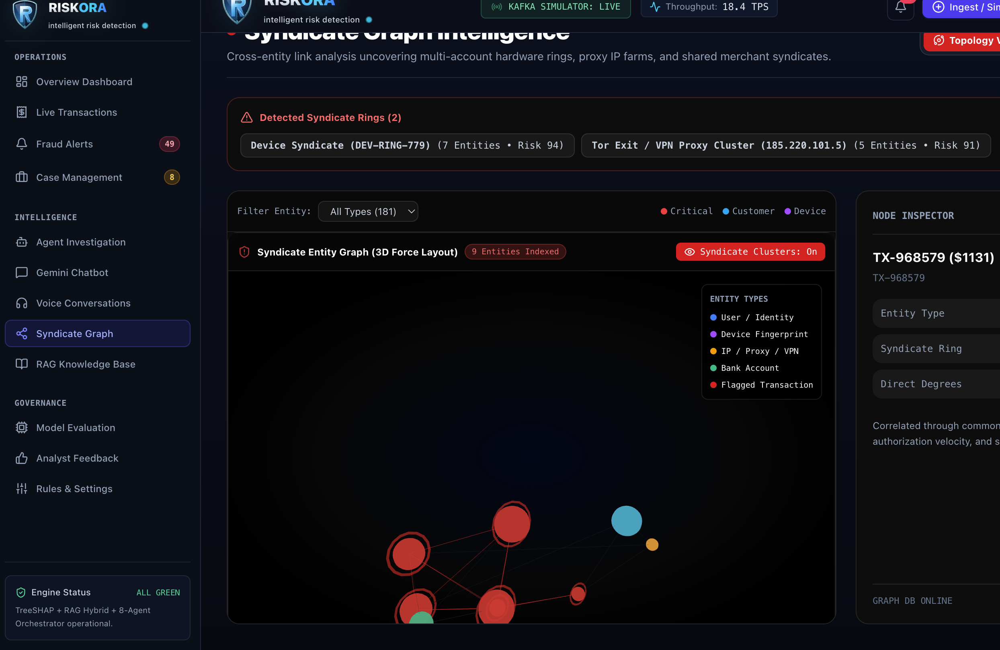
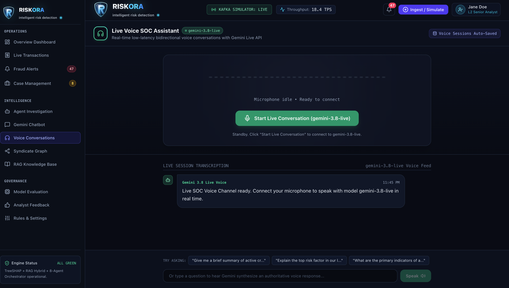

# Riskora AI

### AI-Powered Real-Time Fraud Detection & Investigation Platform

[Live Demo](https://riskora-3.onrender.com)
## 📸 Project Screenshots

### Dashboard


### Fraud Analysis


### Risk Assessment


### Investigation


### Analytics


Riskora AI is an intelligent fraud detection and investigation platform designed to identify suspicious transactions, analyze fraud patterns, and assist investigators with AI-powered insights.

The platform combines **AI/ML, rule-based analysis, risk scoring, explainable results, and automated investigation workflows** to help organizations detect and investigate potentially fraudulent activities.

---

## 🚀 Features

### 🔍 Fraud Detection

* Analyze transaction and user activity
* Identify suspicious patterns
* Generate fraud risk scores
* Detect potentially anomalous behavior

### 🤖 AI-Powered Investigation

* AI-assisted fraud investigation
* Automated investigation summaries
* Generative fraud reports
* Suspicious activity analysis
* Context-aware investigation insights

### 📊 Risk Analysis

* Risk scoring
* Fraud indicators
* Transaction-level analysis
* Explainable fraud signals
* Investigation status tracking

### 📈 Dashboard

* Interactive fraud monitoring dashboard
* Risk statistics
* Investigation overview
* Transaction insights
* Visual analytics

### 🛡️ Security

* Environment-based configuration
* API key protection
* Secure backend API
* Authentication-ready architecture

---

## 🏗️ System Architecture

```text
                         ┌─────────────────────┐
                         │      User / Admin    │
                         └──────────┬──────────┘
                                    │
                                    ▼
                         ┌─────────────────────┐
                         │   React Frontend    │
                         │   Dashboard + UI    │
                         └──────────┬──────────┘
                                    │
                              REST / API
                                    │
                                    ▼
                         ┌─────────────────────┐
                         │   Node.js / Express │
                         │     Backend API     │
                         └──────────┬──────────┘
                                    │
                    ┌───────────────┼────────────────┐
                    │               │                │
                    ▼               ▼                ▼
             ┌────────────┐  ┌─────────────┐  ┌──────────────┐
             │ Fraud Risk │  │ AI Analysis │  │ Investigation│
             │   Engine   │  │   Engine    │  │    Engine    │
             └────────────┘  └──────┬──────┘  └──────────────┘
                                    │
                                    ▼
                           ┌─────────────────┐
                           │   Google Gemini │
                           │   AI / GenAI    │
                           └─────────────────┘
```

---

## 🔄 Fraud Investigation Workflow

```text
Transaction / Activity
          │
          ▼
   Data Collection
          │
          ▼
   Rule & Pattern Analysis
          │
          ▼
      Risk Scoring
          │
          ▼
   Suspicious Activity?
       /          \
     No            Yes
     │              │
     ▼              ▼
  Normal       AI Investigation
                    │
                    ▼
             Fraud Explanation
                    │
                    ▼
            Investigation Report
```

---

## 🛠️ Tech Stack

### Frontend

* React.js
* TypeScript
* Vite
* Tailwind CSS
* Lucide React
* Recharts
* Motion

### Backend

* Node.js
* Express.js
* TypeScript
* REST APIs

### AI

* Google Gemini API
* Google GenAI SDK
* AI-powered fraud analysis
* Generative investigation reports

### Database / Services

* Firebase
* Environment-based configuration

### Visualization

* Recharts
* Interactive dashboard components

### Deployment

* Render
* GitHub

---

## 📂 Project Structure

```text
Riskora/
│
├── src/
│   ├── components/
│   ├── pages/
│   ├── services/
│   ├── hooks/
│   └── ...
│
├── server/
│   ├── ...
│
├── public/
│
├── package.json
├── tsconfig.json
├── vite.config.ts
├── .env.example
└── README.md
```

> The exact structure may vary depending on the current implementation.

---

## ⚙️ Installation

### 1. Clone the repository

```bash
git clone https://github.com/udaykumar09072006/Riskora.git
```

```bash
cd Riskora
```

### 2. Install dependencies

Using Bun:

```bash
bun install
```

Or using npm:

```bash
npm install
```

### 3. Configure environment variables

Create a `.env` file:

```env
GEMINI_API_KEY=your_gemini_api_key
NODE_ENV=development
```

Never commit your `.env` file to GitHub.

### 4. Start development server

```bash
bun run dev
```

Or:

```bash
npm run dev
```

---

## 🔐 Environment Variables

| Variable         | Description                                | Required |
| ---------------- | ------------------------------------------ | -------- |
| `GEMINI_API_KEY` | Google Gemini API key for AI investigation | Yes*     |
| `NODE_ENV`       | Application environment                    | Yes      |
| `PORT`           | Server port                                | No       |

* Required for AI-powered investigation and generative fraud reports.

---

## 🚀 Deployment

Riskora AI is deployed using **Render**.

### Production Build

```bash
bun install
bun run build
```

### Start

```bash
bun run start
```

Production environment variables should be configured directly in Render.

### Live Application

**https://riskora-3.onrender.com**

---

## 🧪 Testing

Before deployment, verify:

```bash
bun run build
```

Then start the production application:

```bash
bun run start
```

Check:

* Frontend loading
* API connectivity
* Fraud analysis
* Risk scoring
* AI investigation
* Report generation
* Environment variables

---

## 🎯 Use Cases

Riskora AI can be adapted for:

* Banking fraud detection
* Digital payment monitoring
* E-commerce fraud prevention
* Account takeover detection
* Suspicious transaction investigation
* Financial crime investigation
* Risk monitoring systems

---

## 🔮 Future Improvements

* Real-time transaction streaming
* Advanced graph-based fraud detection
* Multi-agent fraud investigation
* RAG-based case retrieval
* Fraud relationship graphs
* Real-time alerts
* Advanced anomaly detection
* Investigator collaboration
* Explainable AI dashboards
* Scalable microservice architecture

---

## 📌 Project Highlights

* AI-powered fraud investigation
* Risk-based transaction analysis
* Explainable fraud indicators
* Interactive analytics dashboard
* Automated investigation reports
* Full-stack architecture
* Cloud deployment with Render

---

## 👨‍💻 Developer

**Uday Kumar**

Computer Science Engineering Student

GitHub:
https://github.com/udaykumar09072006

---

## 📄 License

This project is developed for educational, research, and demonstration purposes.
